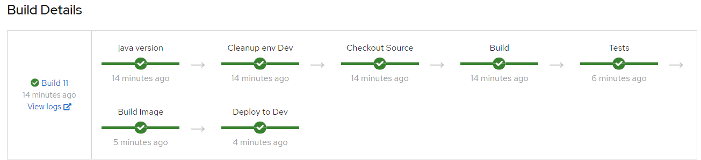

## CI/CDパイプラインによるテスト

```
$ mvn quarkus:add-extensions -Dextensions="openshift" 
[INFO] Scanning for projects...
[INFO] 
[INFO] ------------------------< com.example:testapp >-------------------------
[INFO] Building testapp 1.0-SNAPSHOT
[INFO] --------------------------------[ jar ]---------------------------------
[INFO]
[INFO] --- quarkus-maven-plugin:1.7.5.Final-redhat-00011:add-extensions (default-cli) @ testapp ---
? Extension io.quarkus:quarkus-openshift has been installed
[INFO] ------------------------------------------------------------------------
[INFO] BUILD SUCCESS
[INFO] ------------------------------------------------------------------------
[INFO] Total time:  2.550 s
[INFO] Finished at: 2021-01-05T00:03:21+09:00
[INFO] ------------------------------------------------------------------------


pom.xml
    <dependency>
      <groupId>io.quarkus</groupId>
      <artifactId>quarkus-openshift</artifactId>
    </dependency>


application.properties
%prod.quarkus.kubernetes-client.trust-certs=true
%prod.quarkus.kubernetes.deploy=true
%prod.quarkus.kubernetes.deployment-target=openshift
%prod.quarkus.openshift.expose=true

%prod.quarkus.container-image.build=true
%prod.quarkus.openshift.labels.app.openshift.io/runtime=quarkus
%prod.quarkus.s2i.base-jvm-image=registry.access.redhat.com/ubi8/openjdk-11

Jenkinsfile
[Jenkinsfile](./Jenkinsfile)

Create BC
$ oc new-build --name=testapp-pipeline --strategy=pipeline https://github.com/rhnkoike/testapp.git
    * A pipeline build using source code from https://github.com/rhnkoike/testapp.git will be created
      * Use 'oc start-build' to trigger a new build

--> Creating resources with label build=testapp-pipeline ...
    buildconfig.build.openshift.io "testapp-pipeline" created
--> Success

対応したこと
- masterブランチ作成
- maven.compiler.source/targetを1.8に変更（->JAVA_HOME指定により回避）
- TestDatabaseをコメントアウト
- %testを実DB接続設定に変更
- labelを変更


log
[jenkinsbuild.log](./jenkinsbuild.log)




```